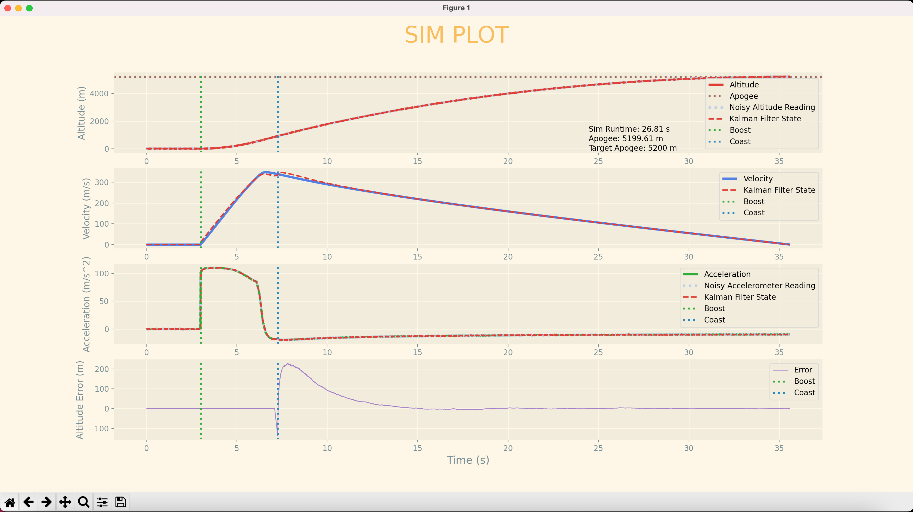

# RocketSIM
- Simulation of rocket from launch to apogee
- Plots Altitude, Velocity, Acceleration
- Accounts for Aerodynamic Drag
- Constantly calculates and predicts apogee based on current flap configuration
- Active Drag Control System (ADCS) with PID/LQR controller for rocket to reach desired apogee (5200 m)
- Simulated Noisy Sensor Data from IMU/Barometer
- State Estimation using Kalman Filter with inputted noisy sensor data

 
## Future Additions to RocketSIM
 - Randomized wind vector
 - RK4 propogation

## Rocket Simulation Plot

 ### Credits
 - AeroTech Thrust Data Table csv for M2500T --> (https://www.thrustcurve.org/simfiles/5f4294d20002e900000003de/) 
 - ISSUIUC/TARS-CONTROLS Code Framework for 1dof_sim_RK4.py --> (https://github.com/ISSUIUC/TARS-Controls)
 - Air density equation relative to altitude --> (https://www.homerenergy.com/products/pro/docs/latest/altitude.html)
 - MS5611 Barometer Datasheet --> (https://www.te.com/commerce/DocumentDelivery/DDEController?Action=showdoc&DocId=Data+Sheet%7FMS5611-01BA03%7FB3%7Fpdf%7FEnglish%7FENG_DS_MS5611-01BA03_B3.pdf%7FCAT-BLPS0036)
 - LSM9DS1 Intertial Measurement Unit (IMU) Datasheet --> (https://www.st.com/resource/en/datasheet/lsm9ds1.pdf)
 - LQR Control Example --> (https://automaticaddison.com/linear-quadratic-regulator-lqr-with-python-code-example/#LQR_Python_Code)
 - State Space Model: Derivation of A and B matricies --> (https://automaticaddison.com/how-to-derive-the-state-space-model-for-a-mobile-robot/)
